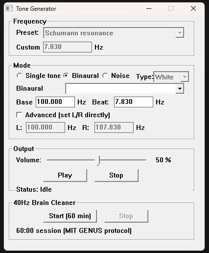

# Tone Generator

A lightweight Windows tone generator that produces pure sine tones from first principles. No samples, no synth libraries -- every sound you hear is computed mathematically in real time. Built in C with the classic Win32 look.

<p align="center">
  
</p>

---

## Getting Started

1. Run **ToneGen.exe** (no installation required).
2. Pick a preset from the dropdown, or type a frequency into the **Custom** field and click outside it to confirm.
3. Click **Play**. You will hear a pure sine tone.
4. Drag the **Volume** slider to adjust loudness.
5. Click **Stop** to fade out cleanly.

> **Note:** After typing a custom frequency, you must click outside the edit field (or tab away) before clicking Play, so the new value is committed.

---

## Modes

### Single Tone

Both ears receive the same frequency. Good for meditation drones, tuning instruments, or testing speakers.

### Binaural

Each ear receives a slightly different frequency. Your brain perceives a rhythmic "wobble" at the difference between the two. This perceived wobble is the **binaural beat**.

> **Headphones are required** for binaural beats to work -- speakers mix the channels and cancel the effect.

---

## How Binaural Beats Work

A binaural beat is not a real sound in the air. It is created by your brain when it receives two close but different frequencies, one in each ear. The brain perceives a pulsing tone at the difference frequency.

**Example:** Left ear = 200 Hz, right ear = 207.83 Hz.
Your brain hears a steady tone around 200 Hz with a **7.83 Hz wobble** layered on top. That wobble is the binaural beat. You cannot hear 7.83 Hz directly (it is far below the ~20 Hz threshold of human hearing), but through the binaural effect your brain entrains to it.

**The formula:**

```
binaural beat frequency = |right ear - left ear|
```

So to target a specific binaural beat:

```
right ear = left ear + desired beat
```

The "left ear" frequency (the **carrier** or **base**) can be anything comfortable to listen to. Most people use **100--400 Hz** as a carrier. The carrier is what you consciously hear; the beat is what your brain entrains to.

---

## Using Base + Beat (Simple Method)

1. Switch to **Binaural** mode.
2. Type your carrier into the **Base** field (e.g. `200`).
3. Type your desired binaural beat into the **Beat** field (e.g. `7.83`).
4. The program automatically calculates:
   - Left = Base = **200.000 Hz**
   - Right = Base + Beat = **207.830 Hz**
5. Put on headphones and click **Play**.

### Examples

| Goal | Base | Beat | Left | Right |
|------|------|------|------|-------|
| Schumann 7.83 Hz | 200 | 7.83 | 200 Hz | 207.83 Hz |
| Alpha 10 Hz | 150 | 10 | 150 Hz | 160 Hz |
| Gamma 40 Hz | 300 | 40 | 300 Hz | 340 Hz |

---

## Using L/R Directly (Advanced Method)

1. Switch to **Binaural** mode.
2. Tick **"Advanced (set L/R directly)"**.
3. Type the exact frequency for each ear.

This gives you full control. The binaural beat is always `|R - L|`.

### Examples

| Goal | L | R | Resulting Beat |
|------|---|---|----------------|
| Schumann 7.83 Hz | 200 | 207.83 | 7.83 Hz |
| Theta 6 Hz | 250 | 256 | 6 Hz |
| Pure unison (no beat) | 432 | 432 | 0 Hz |

> **Tip:** For effective brainwave entrainment, keep the beat frequency below ~40 Hz and keep L and R within about 30 Hz of each other. Wider gaps produce an audible pitch difference rather than a perceived wobble.

---

## Sub-Audible Frequencies

Human hearing ranges from roughly **20 Hz to 20,000 Hz**. Many of the frequencies in the reference table below are far below 20 Hz. You cannot hear them as a direct tone through speakers.

Use them as **binaural beats** instead: set the frequency as the Beat value, pick a comfortable Base, and wear headphones. The status bar will warn you if you try to play a sub-audible frequency in Single mode.

---

## Building from Source

**Requirements:** MinGW-w64 (gcc) and GNU make.

```
make            # Build ToneGen.exe
make test       # Run the unit tests (15 tests)
make clean      # Remove built files
```

---

## Frequency Reference

Frequencies commonly discussed in healing, meditation, brainwave entrainment, and new age contexts. Ranked roughly from most widely cited to least.

Frequencies marked with **\*** are below 20 Hz and should be used as binaural beats, not direct tones.

### Solfeggio & Tuning

| # | Hz | Name | Association |
|---|-----|------|-------------|
| 1 | 432 | Verdi tuning / "Natural" A | Claimed to resonate with nature and water; popular alternative to standard 440 Hz |
| 2 | 528 | Solfeggio MI | "Love frequency" / "DNA repair" -- the most cited solfeggio; also called the "miracle tone" |
| 4 | 396 | Solfeggio UT | Liberating guilt and fear |
| 5 | 417 | Solfeggio RE | Facilitating change, undoing situations |
| 6 | 639 | Solfeggio FA | Connecting and relationships |
| 7 | 741 | Solfeggio SOL | Awakening intuition, expression |
| 8 | 852 | Solfeggio LA | Returning to spiritual order |
| 9 | 963 | Solfeggio | Pure miracle tone / pineal gland activation / "frequency of God" |
| 10 | 174 | Solfeggio (extended) | Natural anaesthetic, foundation, pain reduction |
| 11 | 285 | Solfeggio (extended) | Healing tissue, cellular repair |
| 13 | 440 | Standard concert pitch A4 | Universal tuning reference |
| 14 | 256 | Scientific C / Verdi C | C4 in scientific tuning (A=432); sometimes called the "healing C" |

### Brainwave Entrainment

| # | Hz | Wave | Association |
|---|-----|------|-------------|
| 3 | 7.83* | Schumann resonance | Fundamental electromagnetic resonance of the Earth's cavity; grounding, calm, connection to nature |
| 12 | 40* | Gamma | Insight, peak focus, higher cognitive function; research links 40 Hz to clearing amyloid plaques (Alzheimer's research) |
| 15 | 10* | Alpha | Relaxation, calm alertness, light meditation; the classic "alpha state" |
| 16 | 4* | Theta | Deep meditation, dreaming, intuition, subconscious access |
| 17 | 1.5* | Delta | Deep dreamless sleep, healing, regeneration |
| 18 | 14* | SMR | Sensorimotor rhythm -- relaxed focus, calm body with alert mind; used in neurofeedback |
| 19 | 20 | Low beta | Edge of audibility -- mental alertness, active thinking |
| 29 | 3.5* | Deep theta | Schumann 2nd harmonic region -- profound meditation, trance states |
| 31 | 0.5* | Epsilon | Extremely deep states, suspended animation, extraordinary meditation |
| 37 | 7* | Theta-alpha border | Creativity, visualization, "the twilight zone" between waking and sleep |
| 41 | 2.5* | Deep delta | Cellular regeneration, growth hormone release, immune system support |
| 42 | 12* | Alpha-beta border | Centered awareness, cognitive bridge; used in learning and focus protocols |
| 43 | 15* | Beta | Active concentration, analytical thinking, problem-solving focus |
| 44 | 6.3* | Theta (mid-range) | Creative visualization, emotional processing, self-healing |
| 51 | 0.1* | Hyper-delta / lambda | Sometimes cited as a carrier for "whole-brain synchronisation" |

### Planetary & Cosmic (Hans Cousto Octave Calculations)

| # | Hz | Body | Association |
|---|-----|------|-------------|
| 21 | 136.1 | Earth year (OM) | Cosmic Octave of the Earth's year; used in Indian classical music as the reference SA |
| 22 | 126.22 | Sun | Earth's orbital period around the Sun, octaved up |
| 23 | 194.18 | Earth day | One Earth rotation (24 hrs) octaved into audible range |
| 24 | 210.42 | Moon | Synodic month octaved up; associated with the sacral chakra |
| 25 | 221.23 | Venus | Venus orbital period octaved into audible range |
| 26 | 144.72 | Mars | Strength, energy, willpower |
| 27 | 172.06 | Platonic year | Precession of the equinoxes (~25,772 yrs) octaved up; higher spiritual connection |
| 45 | 187.61 | Mercury | Mental clarity, communication |
| 46 | 295.7 | Saturn | Discipline, structure, boundaries |
| 47 | 207.36 | Uranus | Spontaneity, revolution, awakening |
| 48 | 211.44 | Neptune | Intuition, dreams, the unconscious |
| 49 | 140.25 | Pluto | Transformation, regeneration, hidden depths |

### Sacred, Healing & Other

| # | Hz | Name | Association |
|---|-----|------|-------------|
| 20 | 111 | "Holy frequency" | Measured resonance in ancient temples (Hypogeum of Malta); said to stimulate the prefrontal cortex |
| 28 | 473 | Solfeggio (extended) | Bridging frequency between heart and throat |
| 30 | 33* | Christ consciousness | Cited in some traditions as a resonance of spiritual awakening |
| 32 | 288 | Double 144 | Numerological frequency; associated with abundance and light body activation |
| 34 | 360 | "Balance" | 360 degrees of the circle; associated with wholeness and joy |
| 35 | 480 | "Liberation" | Third harmonic of 160; sometimes cited as a liberation frequency |
| 36 | 720 | Higher-octave healing | Sometimes cited as a higher-octave healing frequency |
| 38 | 108 | Sacred number | 108 is sacred in Hinduism, Buddhism, and Jainism; used in sound healing |
| 39 | 128 | Bone conduction C | Two octaves below 512 Hz (medical tuning fork C); bone conduction healing |
| 40 | 512 | Medical tuning fork C | Used in clinical diagnostics and sound therapy |
| 50 | 27.5 | Sub-bass A0 | Lowest A on a standard piano; at the edge of hearing, felt more than heard |
| 52 | 50 | Gamma (low) | Also mains hum in Europe; some cite 50 Hz as a vitality frequency |
| 53 | 384 | "Truth" | Two octaves of 96; called the "truth frequency" in certain healing lineages |
| 54 | 586 | Higher Solfeggio RE | Sometimes cited as a higher expression of 417 Hz |
| 55 | 888 | "Angel number" | Popular in numerology-based sound healing; associated with abundance |

---

## 40Hz Brain Cleaner

The **40Hz Brain Cleaner** is a dedicated mode at the bottom of the app that replicates the auditory stimulation protocol from MIT's GENUS research (Gamma ENtrainment Using Sensory stimuli). Click **Start** and it takes over -- all other controls are disabled, and the program plays precisely timed **1 ms tone pips at 10 kHz, repeating at exactly 40 Hz**, matching the protocol described in the peer-reviewed literature below.

### What happens in the brain

Gamma oscillations (~40 Hz) are natural brain rhythms tied to attention, perception, and memory. In Alzheimer's disease, these oscillations are disrupted. The 40 Hz auditory stimulus drives an **Auditory Steady-State Response (ASSR)** -- the brain's auditory cortex locks onto the 40 Hz repetition rate, producing strong gamma-frequency neural activity. This entrained gamma activity has been shown in research to:

- Activate **microglia** (the brain's immune cells) to clear amyloid-beta plaques and tau tangles
- Improve **cerebral blood flow** and vascular function
- Reduce **neuroinflammation**
- Strengthen **synaptic connections**
- Improve **memory consolidation**

### The research

The work comes from **Li-Huei Tsai's lab** at MIT's Picower Institute for Learning and Memory. It is among the most promising non-pharmaceutical approaches to Alzheimer's disease currently under investigation.

| Year | Paper | Key Finding |
|------|-------|-------------|
| 2016 | Iaccarino et al., *Nature* 540(7632), 230-235. [doi:10.1038/nature20587](https://doi.org/10.1038/nature20587) | **The original breakthrough.** 40 Hz light flicker reduced amyloid-beta plaques in mouse visual cortex by ~50% and activated microglia to clear toxic protein buildup. |
| 2019 | Martorell et al., *Cell* 177(2), 256-271. [doi:10.1016/j.cell.2019.02.014](https://doi.org/10.1016/j.cell.2019.02.014) | Extended to **auditory stimulation** (the protocol this app replicates). 40 Hz sound reduced plaques in the hippocampus and prefrontal cortex. Mice showed improved memory task performance. |
| 2021 | He et al., *Alzheimer's & Dementia: TRCI* 7(1), e12178. [doi:10.1002/trc2.12178](https://doi.org/10.1002/trc2.12178) | Confirmed **safety and tolerability** of 40 Hz stimulation in human patients over extended periods. |
| 2022 | Chan et al., *Journal of Internal Medicine* 290(5), 993-1009. [doi:10.1111/joim.13329](https://doi.org/10.1111/joim.13329) | **Early human clinical data.** Patients with mild Alzheimer's receiving daily 40 Hz audio-visual stimulation showed reduced brain atrophy and improved functional connectivity vs. controls. |

[Cognito Therapeutics](https://www.cognitotx.com/), an MIT spinoff, is conducting ongoing FDA-approved clinical trials with a dedicated device. This program replicates the auditory component of their protocol as closely as possible using standard PC audio hardware.

> **Disclaimer:** This program is not a medical device and is not FDA-approved for the treatment of any condition. The research is promising but still in clinical trial stages. Consult a healthcare professional before using this as part of any health regimen.

---

## Technical Details

- **Language:** C99
- **Audio:** Windows Multimedia API (`waveOut`) -- 44.1 kHz, 16-bit, stereo
- **Synthesis:** Phase-accumulator sine generation with 10 ms linear fade ramps
- **GUI:** Pure Win32 API (no manifest -- classic gray-bevel look)
- **Threading:** GUI thread + `waveOut` callback thread; `CRITICAL_SECTION`-guarded parameter passing
- **Tests:** 15 unit tests (10 synth, 5 preset) via `assert.h`

---

*Built with gcc (MinGW-w64) on Windows.*
